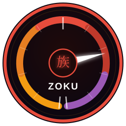
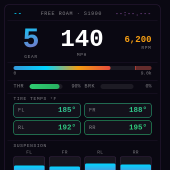
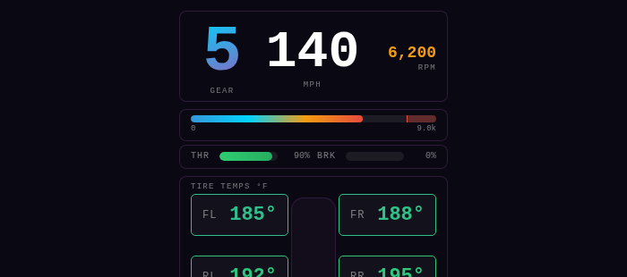
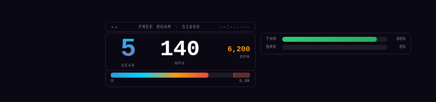

<p align="center">
  
</p>

<h1 align="center">Zoku</h1>
<p align="center">Real-time telemetry overlay for Forza Horizon 6</p>

<p align="center">
  
  
  
  
</p>

---

Zoku is a lightweight, always-on-top overlay that reads Forza Horizon 6's live UDP telemetry stream and displays it directly over your game. No capture card, no second screen required — it floats over your borderless window and gets out of the way when you alt-tab.

It also **auto-records every race session** as a JSON file so you can replay the GPS track, compare laps, and review inputs after the fact.

---

<table>
  <tr>
    <td align="center" width="33%">
      <br>
      <sub><b>Default</b> — consolidated panel</sub>
    </td>
    <td align="center" width="33%">
      <br>
      <sub><b>Exterior</b> — track / chase cam</sub>
    </td>
    <td align="center" width="33%">
      <br>
      <sub><b>Interior</b> — cockpit HUD strip</sub>
    </td>
  </tr>
</table>

---

## Features

- **14 modular widgets** — enable only what you want, position them anywhere
- **Live telemetry** — speed, gear, RPM, throttle/brake, tire temps, suspension, G-force, lap times, boost, power, torque, steering, clutch, tire slip, wheel speeds, fuel
- **Auto-record** — every race saved to `Documents\Zoku\sessions\` at 50ms resolution
- **Session Viewer** — replay any session with a GPS map, scrubber, and variable playback speed
- **Three themes** — Default (consolidated panel), Exterior (track-focused), Interior (HUD strip)
- **Auto-switch themes** — automatically swap layouts when a race starts and ends
- **Theme cycle hotkey** — `Ctrl+Shift+F7` cycles themes instantly
- **Widget edge snapping** — drag widgets in Exterior/Interior themes and edges snap together at 10 px
- **Confinement** — widgets clamp to screen bounds on release (toggleable)
- **Focus-aware** — overlay hides when FH6 loses focus, reappears when you switch back
- **Opacity & scale** — fine-tune transparency and widget size from the Options window
- **Start with Windows** — sits in the tray silently until Forza sends data

## Download

Grab the latest installer from the [Releases](../../releases) page.

> **Requires:** Windows 10/11 · Forza Horizon 6 (PC) · Borderless Windowed display mode

## Setup

### 1 — Configure Forza Horizon 6

In-game: **Settings → HUD & Gameplay → Data Out**

| Setting | Value |
|---------|-------|
| Data Out | **On** |
| IP Address | `127.0.0.1` |
| Port | `20777` |
| Data Out Packet Format | **Car Dash** |

Also set **Settings → Video → Display Mode → Borderless Windowed** — overlays cannot render over Exclusive Fullscreen.

### 2 — Install Zoku

Run `Zoku Setup x.x.x.exe` and follow the prompts. Launch Zoku from the Start Menu or desktop shortcut. A tray icon appears in the bottom-right taskbar.

Start the game. Zoku begins receiving data automatically — no further action needed.

## Controls

| Action | How |
|--------|-----|
| Toggle overlay | `Ctrl+Shift+F6` |
| Cycle theme | `Ctrl+Shift+F7` |
| Lock / unlock widgets | Right-click tray → **Lock / Unlock** |
| Change theme | Right-click tray → **Theme** |
| Toggle widgets | Right-click tray → **Widgets** |
| Opacity & scale | Right-click tray → **Settings** |
| Confine widgets to screen | Right-click tray → **Confine widgets to screen** |
| View sessions | Right-click tray → **Open sessions folder** |

## Widgets

Six widgets are on by default. Eight more are available via **right-click tray → Widgets**.

| Widget | Default | Description |
|--------|---------|-------------|
| Race Status | ✅ | Position, class/PI, lap timer, free-roam / recording badge |
| Gear & Speed | ✅ | Large gear number and speed in MPH |
| RPM Bar | ✅ | Live RPM bar with dynamic redline zone |
| Throttle / Brake | ✅ | Input bars |
| Tire Temps | ✅ | 2×2 temp grid — blue (cold) → green (optimal) → red (hot) |
| Suspension | ✅ | Per-corner compression bars with 30s rolling max |
| G-Force | — | Lateral and longitudinal G bars |
| Lap Times | — | Best (green), last, and current lap in M:SS.mmm |
| Boost / Power / Torque | — | Live boost psi, horsepower, and lb-ft torque |
| Steering | — | Centred bar showing direction and % |
| Clutch / Handbrake | — | Input bars for clutch and handbrake |
| Tire Slip Ratio | — | 2×2 grip/slip grid — green (grip) to red (slip/lock) |
| Wheel Speeds | — | 2×2 in rad/s — red = spinning, blue = locking |
| Fuel Level | — | Fuel % bar — green > 25%, yellow > 10%, red below |

## Themes

| Theme | Best for | Description |
|-------|----------|-------------|
| **Default** | Any view | All widgets stacked in a single merged panel, top-left |
| **Exterior** | Chase / drone cam | Stats spread across the screen; tires centered |
| **Interior** | Cockpit / hood cam | Minimal strip at the bottom, inputs to the right |

Widget positions are saved **per theme** — switching themes always restores wherever you last left each widget for that layout.

**Auto-switch** (right-click tray → Settings) swaps themes automatically when races start and end. Configurable independently for free roam and race.

`Ctrl+Shift+F7` cycles themes manually. When auto-switch is on, the hotkey is a temporary override — auto-switch resumes on the next race state change.

## Session Recording

Zoku records automatically on race entry and stops when the race ends. Files land in:

```
Documents\Zoku\sessions\session_2026-06-08_14-32-00.json
```

Each frame (50ms) captures: speed, RPM, gear, throttle, brake, tire temps, suspension travel, GPS position (X/Y/Z), and lap number.

Open the Session Viewer from **right-click tray → Open sessions folder**, or double-click any `.json` file if you associate it with Zoku.

## Configuration

All settings are stored in plain JSON at:

```
%APPDATA%\Zoku\config.json
```

You can edit this file in any text editor while Zoku is not running. Useful manual edits:

- **Enable a hidden widget** — set `"visible": true` and an `x`/`y` position under `widgetLayouts → <theme> → <widgetId>`
- **Reset a theme layout** — delete the theme's key from `widgetLayouts` and restart Zoku

Widget IDs: `w-race` `w-stats` `w-rpm` `w-inputs` `w-tires` `w-suspension` `w-gmeter` `w-laptimes` `w-boost` `w-steering` `w-clutch` `w-tireslip` `w-wheelspeed` `w-fuel`

## Building from Source

```bash
npm install
npm start        # dev mode (Windows only — needs a display)
npm run build    # packages NSIS installer → dist/
```

> Cross-compiling from Linux works if Wine is installed.

## Troubleshooting

See [FAQ](docs/faq.md) for common issues and solutions.

## Changelog

See [CHANGELOG.md](CHANGELOG.md) for full version history.

---

<p align="center">
  <sub>Plasma dark · built with Electron · MIT License</sub>
</p>
